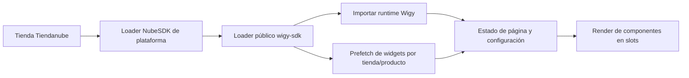

# Cómo aplica Wigy sus módulos: evidencia pública

Observación: 28/09/2026 Argentina; última comprobación HTTP 29/09/2026 00:24 UTC. Investigación de **Wigy**, escrita «Wiggy» en el pedido. Se inspeccionaron demos, recursos públicos y documentación propia. No se instaló, creó cuenta, contrató, escribió datos ni contactó a terceros.

Complementa la [investigación documental](./INVESTIGACION_WIGY_DOCUMENTACION.md) y el [plan](./PLAN_PORTABILIDAD.md).

## Conclusión

**Las demos oficiales inspeccionadas usan NubeSDK y obtienen configuración desde el servicio de Wigy.** El countdown permite comprobar la diferencia con un render inicial nativo: su configuración pública incluye textos que no aparecen en la respuesta HTML inicial.

Esto verifica módulos configurables renderizados en navegador. No demuestra lentitud perceptible ni CLS alto: no hubo un navegador conectado para medirlos. Tampoco acredita que todas las tiendas/clientes/versiones históricas funcionen igual.

## Fuentes y método

El [catálogo oficial](https://www.wigy.app/todos) enlaza directamente la [demo de countdown](https://wigy.mitiendanube.com/productos/cuenta-regresiva/), la [demo de cuotas](https://wigy.mitiendanube.com/productos/badge-de-cuotas/) y una [segunda tienda demo](https://wigydemostraciones.mitiendanube.com/).

Se descargó HTML sin ejecutar JavaScript y se identificaron los recursos declarados por la plataforma. La consulta de configuración usó exclusivamente tienda/producto expuestos por la demo, sin enumerar clientes ni consultar endpoints administrativos. No se copió código propietario al proyecto.

El navegador disponible no tenía ninguna instancia conectada. No hay filmstrip, tiempos de ejecución, FCP/LCP/INP ni medición de CLS. Los tiempos de requests de Python no los sustituyen.

## Flujo observado

Las demos registran un script del CDN Tiendanube bajo `wigy/wigy-sdk/5.js`. El [loader observado](https://apps-scripts.tiendanube.com/wigy/wigy-sdk/5.js?versionId=3vx0GSVKtAcJqqoPUrVQl54KpniVGP7E&store=6790115) intenta precargar widgets mientras importa el runtime. Usa la identidad de tienda y, cuando está disponible, la de producto. Ese prefetch indica `cache: no-store`; esto no describe toda la estrategia de caché del servicio.

El [runtime público](https://wigy.app/nube-sdk/runtime) consume ese prefetch o consulta configuración, conserva un caché en memoria por contexto y renderiza mediante el SDK. Procesa tipo de página y orden de widgets; escucha cambios de página/ubicación y contiene una comprobación periódica de estado. Algunos módulos usan iframes. El almacenamiento async observado guarda una clave pública de tienda; no prueba caché persistente de todos los widgets.

**Inferencia del flujo:** el panel administra configuración en el servicio de Wigy y cada storefront obtiene lo que le corresponde. No se observó un publicador de Twig por tienda. Esta última ausencia no prueba cómo funciona todo su backend privado.

## Prueba concreta: countdown

| Comprobación | Resultado observado |
|---|---|
| Producto demo | ID Tiendanube `338441911`, tomado del formulario real |
| Respuesta pública | Un widget habilitado de tipo `cuenta_regresiva`, con contenido, posición y estilos |
| Textos de prueba | «Black Friday» y «Hasta $25000 OFF» presentes en configuración |
| Textos en HTML inicial | Ninguno presente, tampoco en texto de body sin scripts/estilos |
| Slots iniciales | 143 contenedores vacíos de slots SDK en esa página, incluidos productos relacionados; no son 143 widgets Wigy |
| Clases/IDs Wigy en HTML inicial | No localizados; dato complementario, insuficiente por sí solo |

Fuentes reproducibles: [HTML de demo](https://wigy.mitiendanube.com/productos/cuenta-regresiva/) y [configuración pública de ese producto](https://wigy.app/api/nube/store/6790115/widgets?product_id=338441911). El nombre del producto «Cuenta regresiva» en título/descripción no es el contenido del widget.

**Prueba:** el contenido inspeccionado depende de procesamiento posterior. **No prueba:** demora perceptible, CLS, contenido final durante una sesión ni resultados en otras tiendas. No se ejecutó el countdown ni se evaluó su estado temporal.

## Recursos observados

| Recurso | Tamaño observado | Caché declarada |
|---|---:|---|
| Loader CDN Tiendanube | 1.207 bytes, sin compresión en esa lectura | Inmutable, máximo de un año |
| Runtime Wigy | 839.801 bytes decodificados; 224.927 bytes en una petición gzip | `max-age=60`, `s-maxage=60`, revalidación |
| JSON countdown demo | 1.495 bytes decodificados | Sin deducir política completa |

SHA-256 del runtime: `bc2771b190c9036f38de5c3482dff64cc4654e21a2806b7eb9eb29273a4c8bb3`.

Son observaciones puntuales que pueden cambiar. No equivalen a transferencia total del navegador, compresión Brotli, caché caliente, CPU, SDK de plataforma ni recursos adicionales. No califican por sí solas a Wigy como rápida o lenta.

## Límites documentados de integración

Wigy define prioridad producto > categoría > tienda y permite configurar ubicación/orden. Es una referencia funcional útil para nuestra app. [Crear widget](https://guia.wigy.app/es/articles/14668343-como-creo-un-widget).

Para determinados bundles que reemplazan el formulario nativo, la guía de agosto de 2026 exige pegar CSS por producto en el tema y retirarlo al abandonar el reemplazo. Ese CSS también aparece en la demo inspeccionada. Por tanto, ciertas funciones necesitan intervención adicional. [Cambio de formularios](https://guia.wigy.app/es/articles/16291459-mas-informacion-cambio-en-widgets-con-reemplazo-del-formulario-en-tiendanube).

Compatibilidad, cuotas duplicadas, sincronización y demora de activación se detallan en la [nota documental](./INVESTIGACION_WIGY_DOCUMENTACION.md). La demora de activar una suscripción no es una medición de carga por visita.

## Comparación con nuestro objetivo

| Necesidad | Evidencia de Wigy |
|---|---|
| Panel modular y multitienda | Referencia directa de organización funcional |
| Reglas y edición masiva | Modelo documentado por tienda/categoría/producto |
| Integración sin FTP para funciones soportadas | Coherente con el SDK observado; algunos reemplazos requieren CSS de tema |
| Contenido real en HTML inicial | Countdown inspeccionado depende de configuración/runtime posteriores |
| Costo cero | Hay loader, runtime y consulta; no es costo cero |
| Cero layout shifting | No medido ni encontrado como garantía técnica pública |
| Actualización centralizada | Modelo respaldado por runtime/configuración central; propagación no medida |
| Reestructurar cualquier parte del tema | No se deduce de ofrecer widgets en ubicaciones soportadas |

**Conclusión de diseño:** adoptar el patrón de administración no exige adoptar el mismo render. Si mantenemos contenido crítico en HTML inicial como condición, esta demo no demuestra que el SDK la satisfaga. Si el objetivo pasa a ser una demora visual imperceptible medida, esa es otra condición que requiere benchmark.

La comparación pendiente debe usar contenido equivalente: primera visita/caché caliente, móvil/red lenta, aparición del widget respecto a FCP, CLS atribuido, CPU y proveedores bloqueados. No cambiar la arquitectura por popularidad ni descartar NubeSDK por tamaño del bundle sin medirlo.
