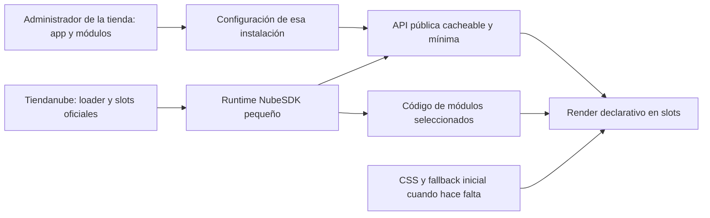

# Plan de app modular con NubeSDK

Síntesis para implementación: [especificación de la app](./SPEC_APP_MODULAR.md), con historias de usuario, decisiones, pruebas y alcance. Los seis tickets aprobados se siguen en [Trimetra-3D/tiendanube-modules](https://github.com/Trimetra-3D/tiendanube-modules/issues).

Estado: planificación. **Decisión vigente del usuario: tomar la estructura de Wigy como referencia**, con módulos opcionales y pequeños ajustes manuales de CSS/HTML. Se reemplaza la propuesta de una app que publique automáticamente archivos del tema. No hay app implementada ni validada en una tienda destino.

## 1. Alcance acordado

- App desde la primera versión; sin asistente local intermedio.
- Instalación independiente en cada tienda; acceso y gestión de sus módulos desde el administrador de esa tienda. El público inicial son tiendas administradas por el usuario, sin dashboard central ni gestión conjunta.
- Conservar la home, productos, configuración y modificaciones existentes del destino.
- Los 26 candidatos del [catálogo](./CATALOGO_MODULOS.md) siguen dentro del relevamiento; cada uno requiere adaptación y comprobación de compatibilidad.
- Panel visible, módulos por ámbito/ubicación, orden, versiones y posibilidad de sumar nuevas mejoras.
- Carga ligera, ausencia de saltos atribuibles a los módulos y contenido nativo de la tienda disponible aunque falle la app.
- El usuario acepta copiar pequeños bloques CSS/HTML para mejorar estabilidad e integración.

**Contrato obligatorio:** [REGLAS_APP.md](./REGLAS_APP.md). Sus límites de carga, integración, fallback y pruebas gobiernan el desarrollo. La existencia de una app similar no sustituye las mediciones.

La UI del SDK se monta en navegador. El contenido crítico que deba existir desde el primer render necesita conservarse en el tema o tener un fallback inicial pequeño. Reservar espacio estabiliza el layout, pero no vuelve instantáneo el contenido remoto. Cada módulo declara expresamente ese límite.

## 2. Arquitectura elegida

### Panel administrativo

La app se instala y se abre desde el administrador de una tienda, con contexto de instalación autorizado. Muestra únicamente sus módulos y configuración. No incluye listado/selector de tiendas, conexión de tiendas adicionales ni rol de gestión multitienda. El acceso usa la integración oficial con Tiendanube; no requiere que el usuario elija otra tienda dentro de la app.

Catálogo de módulos con ejemplos, ubicación, configuración, presupuesto, dependencias y estado. Reglas por tienda, categoría y producto; prioridad explícita producto > categoría > tienda cuando corresponda a la función. Orden y desempate deterministas, sin duplicar widgets.

Estado por combinación módulo/tema/ubicación: disponible, configurado, integración pendiente, preparado para prueba, compatible comprobado y publicado. Diferenciar guardar de aplicar y de verificar en storefront.

### Backend

Gestiona cada instalación, sus autorizaciones, módulos, configuración pública, contenido y revisiones. Puede servir varias instalaciones independientes con aislamiento, sin exponer un gestor conjunto al usuario. Resuelve el contexto administrativo mediante la autorización de la instalación, no mediante un ID arbitrario. Propone una respuesta agregada por contexto y caché con revisión/caducidad. No envía secretos ni copia el catálogo entero para una visita. Datos de precio, stock y checkout conservan su autoridad nativa.

Implementación propuesta: TypeScript, backend Node y PostgreSQL; panel web separado del bundle de tienda. Stack/hosting se fijan al implementar. No construir un sistema de publicación FTPS como requisito de este producto.

### Storefront

Runtime oficial NubeSDK y componentes declarativos. Usar eventos/estado de plataforma para variantes, carrito y navegación, sin manipulación directa del DOM desde el Worker. Separar núcleo y familias de módulos; cargar solo lo necesario, en paralelo con configuración cuando exista contexto suficiente.

No enviar React/otras bibliotecas del panel al storefront. No duplicar loader SDK, jQuery, Swiper, fuentes ni frameworks CSS. Si una capacidad no está expuesta por el SDK, declararla y evaluar una integración pequeña; no reemplazarla con un script oculto fuera del modelo de plataforma.

### Integración manual limitada

Slots estándar primero. El panel genera un bloque CSS consolidado por tienda y, solo donde haga falta, fragmentos de ubicación/fallback. Objetivo estándar: hasta 50 líneas CSS legibles y hasta 10 líneas por ubicación especial. Los límites completos y la retirada están en las [reglas](./REGLAS_APP.md).

El código incluye namespace y versión, instrucciones exactas y verificación. No puede ocultar precio/compra/formulario nativos dejando al visitante sin función cuando la app falla. Una reserva vacía grande sin fallback útil no se considera solución terminada.

Un slot personalizado puede requerir una llamada de plantilla, no HTML pegado en cualquier editor. Tiendas antiguas con slots faltantes pueden superar el perfil pequeño: la app informa preparación adicional. No exigir FTP ni automatizar cambios de tema en el flujo estándar.

## 3. Tratamiento de los módulos

| Familia | Enfoque del producto | Límite que debe mostrar el panel |
|---|---|---|
| Opiniones, beneficios, propuesta de valor, banners | Widgets SDK con ubicación y reserva responsiva cuando afecten el flujo | El contenido remoto no existe por defecto en el HTML inicial; crítico requiere fallback |
| Producto/video y ofertas/video | Componentes SDK y datos de plataforma soportados; poster y carga bajo demanda | No congelar precio/stock ni insertar medios de dimensiones desconocidas |
| Countdown y mensajes de campaña | Caja estable, cifras de ancho fijo y mensaje inicial útil cuando se requiera | Expiración, error y caché no pueden colapsar el header ni mostrar una promo falsa |
| Badges/cuotas | Slots adecuados; evitar información duplicada y conservar dato financiero nativo | Reemplazo o desactivación de contenido nativo exige prueba de recuperación |
| Catálogo, variantes y navegación | Primero capacidades oficiales y CSS pequeño sobre estructura estable | No asumir que SDK puede cambiar arbitrariamente jerarquía u orden nativo; marcar integración mayor si corresponde |
| Descripciones, páginas y landing | Widgets de contenido en ubicaciones admitidas; conservar página/categoría nativas | Una página entera nativa e inmediata no se obtiene con un slot vacío ni un pequeño fragmento HTML; declarar modo y límites |
| Preventas | Selección/configuración específica del destino y datos soportados | No convierte la consulta de seña en cobro automático ni altera checkout |
| Chat y multimedia pesada | Control disponible, proveedor/contenido pesado al solicitarlo | Carga remota inevitable; fuera de la dependencia visual de compra |
| Analytics | Eventos SDK pertinentes, sin duplicar ecommerce y sin bloquear UI | Tiene costo de ejecución/tráfico y debe medirse |
| Checkout | Únicamente APIs/slots y estilos admitidos, con prueba separada | No portar overlays sobre Mercado Pago ni prometer reestructuración libre |

Todos los candidatos permanecen visibles. «En catálogo» no equivale a «instalable con poco código». Si una función exige mucho HTML, cambios amplios de Twig o no pasa la regla de estabilidad, se informa como integración mayor/no validada antes de ofrecer activarla. No reducir el alcance silenciosamente ni prometer equivalencia imposible.

## 4. Reglas de datos y actualización

1. Configuración pública separada por tienda, contexto y revisión; prioridad resuelta y respuesta agrupada.
2. Cargar solo campos necesarios; evitar una petición por widget o por producto de una grilla.
3. Caché de contenido estático permitido; nunca conservar condiciones comerciales vencidas ni tratar importes publicados como autoridad financiera.
4. Cancelar o descartar respuestas que pertenecen a otra ruta/producto y limpiar efectos de módulos retirados.
5. Versionar núcleo, módulos, schema, configuración e integración manual. Una publicación debe respetar compatibilidad entre esas versiones.
6. Si cambia geometría, el panel indica actualización CSS/fallback antes de activar. No reescribir automáticamente código ajeno ni ofrecer un resultado seguro sin comprobarlo.
7. Menús, orden de home, productos e imágenes administradas siguen perteneciendo al destino. Los cambios que requieran el personalizador se muestran como tareas explícitas.
8. La política de scripts/aplicaciones se cumple mediante el flujo oficial. El CSS/HTML manual no es una vía para introducir scripts alternativos.

## 5. Cómo evitar lo observado en el origen

La [auditoría de los módulos actuales](./INVESTIGACION_RENDER_MODULOS.md) encontró obstáculos que no debemos trasladar: countdown oculto y con ceros hasta JS, estilos de geometría diferidos, variantes reordenadas al iniciar, textos de pago reescritos, imágenes visibles descubiertas tarde y overlays de checkout frágiles.

La corrección concreta depende del nuevo renderer, pero el criterio se mantiene: no desplazar ni esconder funciones nativas para hacer aparecer la app. El presupuesto de bundle se controla desde el inicio; no crecer hasta un runtime monolítico para luego intentar separarlo.

## 6. Flujo de instalación y uso

1. Instalar en una tienda mediante autorización oficial y abrir la app desde su administrador; resolver esa instalación y leer sus capacidades/slots.
2. Elegir módulos y ámbito desde el panel. Mostrar efecto, ubicación, compatibilidad e integración requerida antes de activar.
3. Generar el pequeño bloque CSS/HTML si corresponde; conservar guía de instalación y de retirada.
4. Verificar integración y probar en tienda; no tratar la vista previa del panel como prueba de storefront.
5. Publicar configuración/versiones y confirmar que aparecen como se esperaba. Advertir la propagación real cuando exista caché, sin confundirla con el tiempo de render de cada visita.
6. Actualizar/desactivar conservando datos de la tienda y mostrando qué integración queda por retirar.

El storefront nativo debe permanecer usable con backend de la app caído, script bloqueado o respuesta vacía. Los widgets pueden no estar disponibles; el precio y el proceso de compra nativos no se sacrifican por ello.

## 7. Pruebas y criterios de aceptación

La suite de [REGLAS_APP.md](./REGLAS_APP.md) es obligatoria. Incluye caché fría/caliente, SDK/API retrasados 10 segundos, errores y módulos apagados, textos largos, zoom, medios lentos, cambios de variante/ruta y desinstalación.

Medir por separado:

- CLS atribuible y geometría, incluso con scroll temprano.
- Tiempo real de aparición del widget respecto del contenido nativo/FCP.
- Bytes, requests, CPU, LCP e INP; costo propio y costo total con plataforma/terceros.
- Estado de compra nativa antes, durante y después de fallos.

Clase A requiere contenido esencial inicial o fallback comprobado. Clase B necesita espacio estable y cumplir el objetivo medido de aparición; un hueco inmóvil no se etiqueta como carga inmediata. Clase C deja claro que su función pesada se solicita al interactuar.

## 8. Desarrollo incremental del producto definitivo

1. **Base de la app:** instalación/acceso desde el administrador de la tienda, panel de sus módulos, OAuth y API de configuración; detección de slots y modelo de versiones.
2. **Dos widgets representativos:** countdown y bloque de opiniones/beneficios; integración mínima, carga paralela y pruebas de estabilidad/latencia.
3. **Biblioteca de 26 candidatos:** adaptar por familia, documentar capacidad y requisitos, validar cada ubicación. No habilitar un módulo solo porque compiló.
4. **Operación de cada instalación:** actualizaciones compatibles, caché/invalidación, fallos, desactivación y retirada de su integración manual.

No hay herramienta local descartable ni publicador FTP previo. La primera entrega ya es parte de la app final.

## 9. Evidencia y documentos relacionados

- [Reglas obligatorias](./REGLAS_APP.md): contrato actual de calidad.
- [Catálogo de 26 candidatos](./CATALOGO_MODULOS.md): alcance funcional.
- [Wigy: inspección técnica](./INVESTIGACION_WIGY_TECNICA.md): SDK, runtime y configuración observados en demos; no medición de CLS.
- [Wigy: documentación](./INVESTIGACION_WIGY_DOCUMENTACION.md): ámbitos, orden, CSS manual y límites.
- [Inventario](./INVENTARIO_PORTABILIDAD.md): snapshot de 118 diferencias del tema origen; no es la lista de archivos de la app nueva.
- [Límites de plataforma](./INVESTIGACION_LIMITES_TIENDANUBE.md): SDK, permisos, datos y checkout.
- [Auditoría del render de origen](./INVESTIGACION_RENDER_MODULOS.md): evidencia de problemas y alternativas nativas; su propuesta anterior de publicación de tema no es la arquitectura vigente.
- [Investigación de publicación de temas](./INVESTIGACION_PUBLICACION_TEMA.md): alternativa investigada, fuera del flujo estándar elegido.
- [Glosario](./CONTEXT.md): términos compartidos.

La tienda destino y la compatibilidad concreta siguen pendientes de identificar. Los presupuestos son objetivos, no resultados medidos. No se modificaron archivos del tema ni se instaló una app durante esta planificación.
